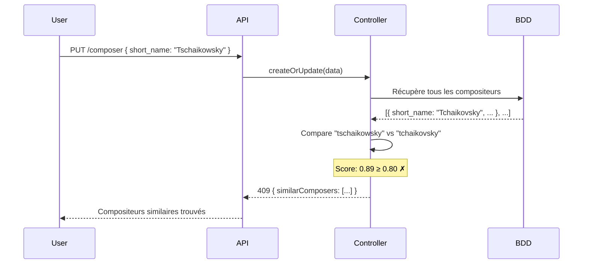

# Documentation — Validation des doublons de compositeurs (Fuzzy Matching)

> **Branche :** `feature/issue-121-fuzzy-composer`
> **Auteure :** Michelle
> **Date :** Juillet 2026
> **Issue :** [#121](https://github.com/Melomania-be/back/issues/121)

---

## 1. Présentation

Cette tâche consiste à mettre en place une **validation automatique pour éviter la création de compositeurs en doublon** dans la base de données de l'application Melomania. Le système détecte les noms similaires même lorsqu'ils sont orthographiés différemment (par exemple "Tchaikovsky" et "Tschaikowsky"), et retourne une liste de suggestions à l'utilisateur avant de créer un nouveau compositeur.

### Pourquoi cette tâche était nécessaire

Les compositeurs sont partagés globalement entre toutes les organisations de l'application (architecture multi-tenant confirmée). Plusieurs organisations peuvent ajouter des compositeurs à la même liste partagée, ce qui crée un risque de doublons dus à des orthographes différentes pour un même nom. Sans validation, la base de données peut rapidement se retrouver avec plusieurs entrées pour le même compositeur, ce qui complique la gestion du répertoire musical.

---

## 2. Contexte

### Fonctionnalité concernée
La création de compositeurs dans l'application Melomania, via le controller `ComposersController` et la route `PUT /composer`.

### Problème rencontré
Aucune validation n'existait pour détecter les doublons lors de la création d'un compositeur. Un utilisateur pouvait créer "Tchaikovsky" et un autre "Tschaikowsky" sans qu'aucune alerte ne soit levée, résultant en deux entrées distinctes pour le même compositeur.

### Conséquences du problème
- Base de données polluée par des doublons de compositeurs
- Incohérence dans le répertoire musical (une même pièce peut être attribuée à deux entrées différentes du même compositeur)
- Difficulté de maintenance et de nettoyage des données

---

## 3. Objectif de la correction

La modification devait permettre de :
- Détecter automatiquement les noms de compositeurs trop similaires avant toute création
- Retourner une liste de compositeurs similaires trouvés plutôt que de créer un doublon
- Laisser le choix à l'utilisateur (via le front-end) de confirmer la création ou d'utiliser un compositeur existant

---

## 4. Solution mise en œuvre

### Vue d'ensemble

Après analyse des différentes approches possibles (fuzzy matching, outil de fusion similaire à celui existant pour les contacts, suggestions UI), l'approche retenue est le **fuzzy matching** : une comparaison de similarité entre les noms au moment de la création, via la librairie `string-similarity`.

### Choix techniques

| Choix | Raison |
|-------|--------|
| Librairie `string-similarity` | Simple, légère, bien adaptée à la comparaison de noms |
| Seuil de similarité à 80% | Assez strict pour éviter les faux positifs, assez souple pour détecter les variantes orthographiques |
| Comparaison sur `short_name` ET `long_name` | Les compositeurs ont deux champs de nom, les deux doivent être vérifiés |
| Retour HTTP 409 | Code standard pour signaler un conflit de ressource |

### Fichiers modifiés

| Fichier | Type | Description |
|---------|------|-------------|
| `app/controllers/composers_controller.ts` | Modifié | Ajout de la validation fuzzy matching dans `createOrUpdate` |
| `package.json` | Modifié | Ajout de `string-similarity` et `@types/string-similarity` |
| `package-lock.json` | Modifié | Mise à jour automatique des dépendances |

### Installation des librairies

```bash
npm install string-similarity --legacy-peer-deps
npm install @types/string-similarity --save-dev --legacy-peer-deps
```

---

## 5. Détails techniques

### Architecture concernée

```
Frontend
    │
    ▼
PUT /composer
    │
    ▼
ComposersController.createOrUpdate()
    │
    ├── Si id présent → mise à jour (pas de vérification doublon)
    │
    └── Si id absent (création) →
            │
            ├── Récupère tous les compositeurs existants
            ├── Compare les noms avec string-similarity
            ├── Score ≥ 80% → retourne 409 avec liste des similaires
            └── Score < 80% → crée le compositeur
```

### Flux d'exécution



### Logique de comparaison

```typescript
const SIMILARITY_THRESHOLD = 0.8

// Pour chaque compositeur existant
for (const composer of existingComposers) {
  // Pour chaque nom à vérifier (short_name et long_name)
  for (const newName of namesToCheck) {
    const score = stringSimilarity.compareTwoStrings(
      newName.toLowerCase(),
      composer.short_name.toLowerCase()
    )
    // Si le score dépasse le seuil → doublon potentiel
    if (score >= SIMILARITY_THRESHOLD) {
      similarComposers.push({ composer, field: 'short_name', score })
    }
  }
}
```

### Format de la réponse en cas de doublon (HTTP 409)

```json
{
  "message": "Similar composers already exist",
  "similarComposers": [
    {
      "id": 42,
      "short_name": "Tchaikovsky",
      "long_name": "Piotr Ilitch Tchaïkovski",
      "similarity_field": "short_name",
      "similarity_score": 89
    }
  ]
}
```

---

## 6. Exemples

### Avant la modification
Un utilisateur pouvait créer "Tschaikowsky" même si "Tchaikovsky" existait déjà. Aucune alerte, aucun contrôle.

### Après la modification

| Nom soumis | Nom existant | Score | Résultat |
|------------|-------------|-------|----------|
| "Tschaikowsky" | "Tchaikovsky" | 89% | ❌ 409 — doublon détecté |
| "Mozartt" | "Mozart" | 92% | ❌ 409 — doublon détecté |
| "Beethoven" | "Mozart" | 18% | ✅ 200 — créé |
| "Bach" | "Bach" | 100% | ❌ 409 — doublon exact |

---

## 7. Impacts

### Utilisateurs
- Lors de la création d'un compositeur, si un nom similaire existe déjà, l'utilisateur reçoit une liste de suggestions au lieu d'un doublon silencieux
- Le front-end peut utiliser cette réponse pour afficher une interface de confirmation

### Développeurs
- La validation ne s'applique qu'à la **création** (pas à la mise à jour) pour éviter de bloquer les modifications légitimes
- Le seuil de 80% est configurable via la constante `SIMILARITY_THRESHOLD` dans le controller

### Maintenance
- La base de données reste propre sans doublons dus aux variantes orthographiques
- Pas de migration nécessaire, la validation est purement applicative

---

## 8. Points d'attention

- **Performance** : la validation récupère tous les compositeurs existants à chaque création. Sur une base très volumineuse, cela pourrait ralentir les requêtes. Une optimisation future pourrait utiliser une recherche indexée.
- **Seuil à 80%** : ce seuil peut générer des faux positifs sur des noms courts (ex: "Bach" et "Rack" pourraient avoir un score élevé). Il peut être ajusté selon les besoins.
- **Mise à jour non bloquée** : la validation ne s'applique pas aux mises à jour (`data.id` présent) pour éviter de bloquer la correction d'un compositeur existant.
- **Sensibilité à la casse** : les comparaisons sont effectuées en minuscules pour éviter que "Mozart" et "mozart" soient considérés comme différents.

---

## 9. Problèmes rencontrés pendant le développement

### Problème 1 — Branche contaminée par `npm audit fix --force`
Lors du premier essai, la commande `npm audit fix --force` a été lancée accidentellement, ce qui a mis à jour de nombreux packages majeurs sans rapport avec la tâche (`@adonisjs/auth`, `@adonisjs/mail`, `@adonisjs/cors`, etc.). Ces mises à jour risquaient de casser l'application et ont été rejetées par le superviseur lors de la revue de code.

**Solution :** Création d'une nouvelle branche fraîche depuis `dev` en installant uniquement `string-similarity` et `@types/string-similarity` sans lancer `npm audit fix`.

### Problème 2 — Branche contenant du code sans rapport
La première branche (`feature/issue-121-duplicate-composer-validation`) contenait également le code de sauvegarde de la base de données (tâche #122) ainsi que des migrations et controllers liés à l'architecture multi-tenant, car elle avait été créée depuis une mauvaise base.

**Solution :** Repartir depuis `dev` mis à jour avec uniquement les modifications liées au fuzzy matching, résultant en seulement 3 fichiers dans le commit final.

### Problème 3 — Conflits Git lors du rebase
Lors du rebase de la branche backup sur `dev`, des conflits sont apparus sur `routes.ts` car la branche `dev` avait évolué entre temps (ajout de nouveaux controllers et routes par l'équipe).

**Solution :** Résolution manuelle des conflits en conservant les modifications de `dev` et en réintégrant les routes `/settings` dans le bon groupe (groupe authentifié).

---

## 10. Tests réalisés

| Scénario | Résultat attendu | Résultat obtenu |
|----------|-----------------|-----------------|
| Créer "Tchaikovsky" (aucun existant) | 200 — compositeur créé | ✅ Correct |
| Créer "Tschaikowsky" (Tchaikovsky existe) | 409 — doublon détecté | ✅ Correct |
| Créer "Mozart" (Beethoven existe) | 200 — compositeur créé | ✅ Correct |
| Mettre à jour un compositeur existant | 200 — pas de vérification doublon | ✅ Correct |

---

## 11. Conclusion

Cette modification améliore la qualité des données de l'application Melomania en empêchant la création silencieuse de doublons de compositeurs. La solution est légère, non-intrusive (pas de migration), et facilement extensible à d'autres entités si nécessaire. Le front-end peut exploiter la réponse 409 pour proposer une interface de sélection ou de confirmation à l'utilisateur.
