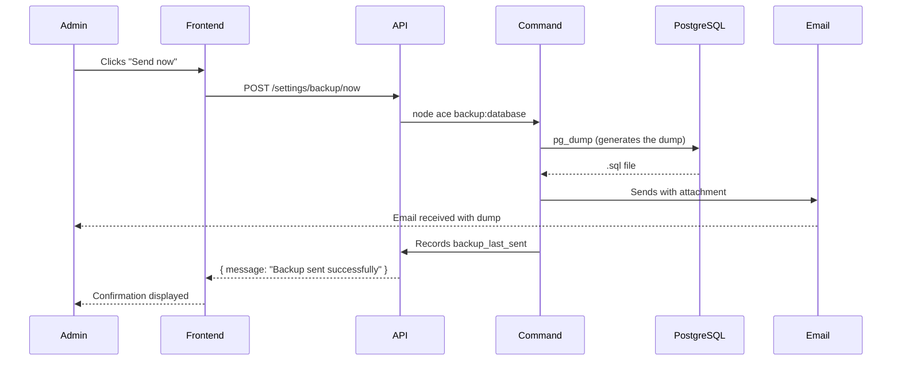

# Documentation — Automatic Database Backups

> **Branch:** `feature/database-backup`
> **Author:** Michelle
> **Date:** June 2026

---

## 1. Overview

This task consists of setting up an **automatic weekly backup system** for the Melomania application database. The system generates a full copy of the database (called a *dump*), sends it by email to a configurable address, and allows administrators to manage this feature directly from a settings page in the application.

### Why this task was necessary

Without automatic backups, any data loss (due to a failure, human error, or an attack) would be irreversible. This system ensures a recent copy of the database is always available, without manual intervention.

---

## 2. Context

### Feature concerned
The PostgreSQL database of the Melomania application, which contains all business data (projects, participants, musical repertoire, contacts, etc.).

### Problem encountered
There was no automatic backup mechanism for the database. In case of an incident, it was impossible to restore the database to a previous state.

### Consequences of the problem
- Risk of permanent data loss in case of an incident
- No traceability of backups performed
- Inability to restore the database to a previous state

---

## 3. Goal of the fix

The modification aimed to:
- Automatically generate a full database backup every week
- Send this backup by email to a configurable address
- Allow administrators to manage backup settings from the interface
- Trigger a manual backup at any time
- Easily enable or disable the feature

---

## 4. Solution implemented

### Overview

The solution relies on three main components:
1. An **AdonisJS command** that generates the dump and sends the email
2. A **settings controller** that exposes a REST API to manage the parameters
3. A **Settings page** in the interface (developed by the front-end partner)

### Technical choices

| Choice | Reason |
|--------|--------|
| `pg_dump` to generate the dump | Official PostgreSQL tool, reliable and standard |
| `saves` table to store settings | Existing key-value table in the database, easily extensible |
| AdonisJS command | Integrates naturally into the existing project architecture |
| Configurable `pg_dump` path via `.env` | Compatibility between Windows and Docker environments |

### Files modified or created

| File | Type | Description |
|------|------|-------------|
| `commands/backup_database.ts` | Created | Command that generates the dump and sends the email |
| `app/controllers/settings_controller.ts` | Created | Controller to manage settings |
| `start/routes.ts` | Modified | Added `/settings` routes |
| `.env` | Modified | Added `BACKUP_EMAIL` and `PG_DUMP_PATH` variables |

### New environment variables

```env
BACKUP_EMAIL=destination@email.com
PG_DUMP_PATH=C:\Program Files\PostgreSQL\18\bin\pg_dump.exe  # Windows
# or
PG_DUMP_PATH=pg_dump  # Docker / Linux
```

### Variables stored in the database (`saves` table)

| Variable | Description | Example value |
|----------|-------------|---------------|
| `backup_enabled` | Enables or disables backups | `true` / `false` |
| `backup_email` | Destination email address | `admin@melomania.be` |
| `backup_frequency` | Backup frequency | `weekly` |
| `backup_last_sent` | Date of last backup sent | `2026-06-01T08:00:00.000Z` |

---

## 5. Technical details

### Architecture

```
Interface (Svelte)
      │
      ▼
REST API (AdonisJS)
      │
      ├── GET  /settings         → Read settings
      ├── POST /settings         → Save a setting
      └── POST /settings/backup/now → Trigger an immediate backup
            │
            ▼
      backup:database command
            │
            ├── Checks backup_enabled
            ├── Creates backup/ folder if missing
            ├── Generates the dump with pg_dump
            ├── Sends the email with the dump as attachment
            ├── Records the date in backup_last_sent
            └── Deletes the temporary file
```

### Execution flow



### Business logic of the `backup:database` command

1. **Check**: the command reads `backup_enabled` from the database. If the value is `false`, it stops immediately without doing anything.
2. **Folder creation**: if the `backup/` folder does not exist, it is created automatically.
3. **Dump generation**: `pg_dump` is called with the connection parameters from `.env`. The path to `pg_dump` is also configurable via `PG_DUMP_PATH`.
4. **Email retrieval**: the destination address is read from the `BACKUP_EMAIL` environment variable only (not from the database, for security reasons).
5. **Email sending**: the `.sql` file is attached to an email and sent.
6. **Recording**: the send date is saved in `backup_last_sent`.
7. **Cleanup**: the temporary file is deleted from the server.

### REST API — `SettingsController`

```
GET  /settings
  → Returns all settings stored in the saves table
  → Response: [{ id, variable, value, created_at, updated_at }, ...]

POST /settings
  → Body: { variable: string, value: string }
  → Creates or updates the corresponding setting
  → Note: backup_email cannot be set via this route (403 Forbidden)
  → Response: { id, variable, value, ... }

POST /settings/backup/now
  → Immediately triggers the backup:database command
  → Success response: { message: "Backup sent successfully" }
  → Error response: { message: "Backup failed", error: "..." }
```

> ⚠️ These routes are **protected by authentication**. Only logged-in users can access them.

---

## 6. Examples

### Before the modification
There was no way to back up the database other than manually through a terminal. No interface, no automation, no traceability.

### After the modification

**From the interface:**
- The administrator opens the **Settings** page
- They see the **"Regular database backups"** section with:
  - An **ON/OFF slider** to enable or disable backups
  - A field for the **destination email address**
  - A field for the **frequency**
  - The **date of the last backup sent**
  - A **"Send now"** button

**Example of a generated backup file:**
```
melomania_backup_2026-06-01.sql
```

**File content (excerpt):**
```sql
-- PostgreSQL database dump
-- Dumped from database version 18.3

CREATE TABLE participants ( ... );
INSERT INTO participants VALUES (1, ...);
...
-- PostgreSQL database dump complete
```

---

## 7. Impact

### Users (administrators)
- Can now configure and manage backups without technical intervention
- Automatically receive a copy of the database every week
- Can trigger a manual backup at any time

### Developers
- New command available: `node ace backup:database`
- New routes available: `GET/POST /settings` and `POST /settings/backup/now`
- The path to `pg_dump` must be configured in `.env` depending on the environment

### Maintenance
- The date of the last backup is traceable directly in the database
- The `backup/` folder is created automatically, no need to create it manually
- Temporary files are deleted after sending to avoid filling up disk space

### Compatibility
- **Windows**: set the full path to `pg_dump.exe` in `PG_DUMP_PATH`
- **Docker / Linux**: simply set `pg_dump` in `PG_DUMP_PATH`

---

## 8. Points of attention

- **Email sending test**: email sending could not be tested locally because the SMTP server (`localhost:1025`) is only available on the dev/prod server. The code is in place and should work once deployed.
- **`backup/` folder**: this folder is added to `.gitignore` to prevent backup files from being pushed to GitHub.
- **Security**: `/settings` routes are protected by authentication. The database password is passed via the `PGPASSWORD` environment variable and never appears in logs. The `backup_email` address can only be set via the `.env` file, not via the API.
- **File size**: on a large database, dump files can be heavy. The size of email attachments should be monitored according to SMTP server limits.
- **Scheduling**: the frequency is stored in the database but the actual scheduling (automatic execution) must be configured separately via a cron job or Windows Task Scheduler depending on the deployment environment.

---

## 9. Tests performed

| Scenario | Expected result | Result obtained |
|----------|----------------|-----------------|
| Generate dump locally (Windows) | `.sql` file created in `backup/` | ✅ File created correctly |
| Command with `backup_enabled = false` | Command stops without generating a dump | ✅ Correct behavior |
| Automatic creation of `backup/` folder | Folder created if it does not exist | ✅ Correct behavior |
| Call `POST /settings/backup/now` | Backup triggered from the API | ✅ Works (dump generated) |
| Email sending | Email received with dump as attachment | ⚠️ Not tested locally (SMTP unavailable) |
| Recording of `backup_last_sent` | Date saved in database after sending | ✅ Correctly recorded |
| Docker compatibility | `pg_dump` accessible via PATH | ✅ Validated by the front-end partner |

---

## 10. Conclusion

This modification provides a complete and configurable solution for automatic database backups in Melomania. It significantly improves the application's resilience by allowing data recovery in case of an incident. The Settings page offers a simple interface for administrators, requiring no technical intervention. The system is designed to be easily extensible: other settings can be added to the page in the same way, using the existing `saves` table.
