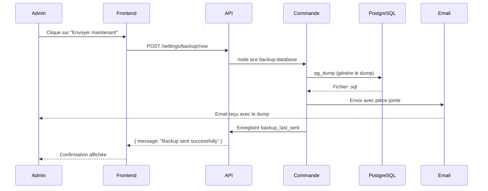

# Documentation — Sauvegardes automatiques de la base de données

> **Branche :** `feature/database-backup`

---

## 1. Présentation

Cette tâche consiste à mettre en place un système de **sauvegarde automatique hebdomadaire** de la base de données de l'application Melomania. Le système génère une copie complète de la base de données (appelée *dump*), l'envoie par email à une adresse configurable, et permet à l'administrateur de gérer cette fonctionnalité directement depuis une page de réglages dans l'application.

### Pourquoi cette tâche était nécessaire

Sans sauvegarde automatique, toute perte de données (suite à une panne, une erreur humaine ou une attaque) serait irrémédiable. Ce système permet de disposer d'une copie récente de la base de données à tout moment, sans intervention manuelle.

---

## 2. Contexte

### Fonctionnalité concernée
La base de données PostgreSQL de l'application Melomania, qui contient toutes les données métier (projets, participants, répertoire musical, contacts, etc.).

### Problème rencontré
Il n'existait aucun mécanisme de sauvegarde automatique de la base de données. En cas de problème, il n'était pas possible de restaurer les données à un état antérieur.

### Conséquences du problème
- Risque de perte définitive de données en cas d'incident
- Aucune traçabilité des sauvegardes effectuées
- Impossibilité de restaurer la base de données à un état antérieur

---

## 3. Objectif de la correction

La modification devait permettre de :
- Générer automatiquement une sauvegarde complète de la base de données chaque semaine
- Envoyer cette sauvegarde par email à une adresse configurable
- Permettre à l'administrateur de gérer les paramètres de sauvegarde depuis l'interface
- Déclencher une sauvegarde manuelle à tout moment
- Activer ou désactiver la fonctionnalité facilement

---

## 4. Solution mise en œuvre

### Vue d'ensemble

La solution repose sur trois éléments principaux :
1. Une **commande AdonisJS** qui génère le dump et envoie l'email
2. Un **contrôleur de réglages** qui expose une API REST pour gérer les paramètres
3. Une **page Réglages** dans l'interface (développée par le binôme front-end)

### Choix techniques

| Choix | Raison |
|-------|--------|
| `pg_dump` pour générer le dump | Outil officiel PostgreSQL, fiable et standard |
| Table `saves` pour stocker les réglages | Table clé-valeur déjà existante dans la BDD, extensible facilement |
| Commande AdonisJS | S'intègre naturellement dans l'architecture existante du projet |
| Chemin `pg_dump` configurable via `.env` | Compatibilité entre environnements Windows et Docker |

### Fichiers modifiés ou créés

| Fichier | Type | Description |
|---------|------|-------------|
| `commands/backup_database.ts` | Créé | Commande qui génère le dump et envoie l'email |
| `app/controllers/settings_controller.ts` | Créé | Contrôleur pour gérer les réglages |
| `start/routes.ts` | Modifié | Ajout des routes `/settings` |
| `.env` | Modifié | Ajout des variables `BACKUP_EMAIL` et `PG_DUMP_PATH` |

### Nouvelles variables d'environnement

```env
BACKUP_EMAIL=adresse@destination.com
PG_DUMP_PATH=pg_dump  # Docker / Linux
```

### Variables stockées en base de données (table `saves`)

| Variable | Description | Exemple de valeur |
|----------|-------------|-------------------|
| `backup_enabled` | Active ou désactive les sauvegardes | `true` / `false` |
| `backup_email` | Adresse email de destination | `admin@melomania.be` |
| `backup_frequency` | Fréquence des sauvegardes | `weekly` |
| `backup_last_sent` | Date du dernier envoi | `2026-06-01T08:00:00.000Z` |

---

## 5. Détails techniques

### Architecture concernée

```
Interface (Svelte)
      │
      ▼
API REST (AdonisJS)
      │
      ├── GET  /settings         → Lire les réglages
      ├── POST /settings         → Sauvegarder un réglage
      └── POST /settings/backup/now → Déclencher un backup immédiat
            │
            ▼
      Commande backup:database
            │
            ├── Vérifie backup_enabled
            ├── Crée le dossier backup/ si absent
            ├── Génère le dump avec pg_dump
            ├── Envoie l'email avec le dump en pièce jointe
            ├── Enregistre la date dans backup_last_sent
            └── Supprime le fichier temporaire
```

### Flux d'exécution



### Logique métier de la commande `backup:database`

1. **Vérification** : la commande commence par lire `backup_enabled` dans la BDD. Si la valeur est `false`, elle s'arrête immédiatement sans rien faire.
2. **Création du dossier** : si le dossier `backup/` n'existe pas, il est créé automatiquement.
3. **Génération du dump** : `pg_dump` est appelé avec les paramètres de connexion issus du `.env`. Le chemin vers `pg_dump` est lui aussi configurable via `PG_DUMP_PATH`.
4. **Récupération de l'email** : l'adresse de destination est d'abord cherchée dans la BDD (`backup_email`), et si absente, dans la variable `BACKUP_EMAIL` du `.env`.
5. **Envoi de l'email** : le fichier `.sql` est attaché à un email et envoyé.
6. **Enregistrement** : la date d'envoi est sauvegardée dans `backup_last_sent`.
7. **Nettoyage** : le fichier temporaire est supprimé du serveur.

### API REST — `SettingsController`

```
GET  /settings
  → Retourne tous les réglages stockés dans la table saves
  → Réponse : [{ id, variable, value, created_at, updated_at }, ...]

POST /settings
  → Corps : { variable: string, value: string }
  → Crée ou met à jour le réglage correspondant
  → Réponse : { id, variable, value, ... }

POST /settings/backup/now
  → Déclenche immédiatement la commande backup:database
  → Réponse succès : { message: "Backup sent successfully" }
  → Réponse erreur  : { message: "Backup failed", error: "..." }
```

> ⚠️ Ces routes sont **protégées par authentification**. Seuls les utilisateurs connectés peuvent y accéder.

---

## 6. Exemples

### Avant la modification
Il n'existait aucun moyen de sauvegarder la base de données autrement que manuellement via un terminal. Aucune interface, aucune automatisation, aucune traçabilité.

### Après la modification

**Depuis l'interface :**
- L'administrateur ouvre la page **Réglages**
- Il voit la section **"Regular database backups"** avec :
  - Un slider **ON/OFF** pour activer ou désactiver les sauvegardes
  - Un champ pour l'**adresse email** de destination
  - Un champ pour la **fréquence**
  - La **date du dernier envoi**
  - Un bouton **"Envoyer maintenant"**


## 7. Impacts

### Utilisateurs
- Peuvent  configurer et gérer les sauvegardes sans intervention technique
- Reçoivent automatiquement une copie de la base de données chaque semaine
- Peuvent déclencher une sauvegarde manuelle à tout moment

### Développeurs
- Nouvelle commande disponible : `node ace backup:database`
- Nouvelles routes disponibles : `GET/POST /settings` et `POST /settings/backup/now`
- Le chemin vers `pg_dump` doit être configuré dans le `.env` selon l'environnement

### Maintenance
- La date du dernier envoi est traçable directement en base de données
- Le dossier `backup/` est créé automatiquement, pas besoin de le créer manuellement
- Les fichiers temporaires sont supprimés après envoi pour ne pas saturer le disque

---

## 8. Tests réalisés

| Scénario | Résultat attendu | Résultat obtenu |
|----------|-----------------|-----------------|
| Génération du dump en local (Windows) | Fichier `.sql` créé dans `backup/` | ✅ Fichier créé correctement |
| Commande avec `backup_enabled = false` | La commande s'arrête sans générer de dump | ✅ Comportement correct |
| Création automatique du dossier `backup/` | Dossier créé s'il n'existe pas | ✅ Comportement correct |
| Appel de `POST /settings/backup/now` | Backup déclenché depuis l'API | ✅ Fonctionne (dump généré) |
| Envoi de l'email | Email reçu avec le dump en pièce jointe | ⚠️ Non testé en local (SMTP indisponible) |
| Enregistrement de `backup_last_sent` | Date sauvegardée en base après envoi | ✅ Enregistrement correct |
| Compatibilité Docker | `pg_dump` accessible via PATH | ✅ Validé par le binôme front-end |

---

## 9. Conclusion

Cette modification apporte une solution configurable pour la sauvegarde automatique de la base de données Melomania. Elle améliore significativement la résilience de l'application en permettant de récupérer les données en cas d'incident. La page Réglages offre une interface simple pour les administrateurs, sans nécessiter d'intervention technique. Le système est conçu pour être facilement extensible : d'autres réglages pourront être ajoutés à la page de la même façon, en utilisant la table `saves` existante.
